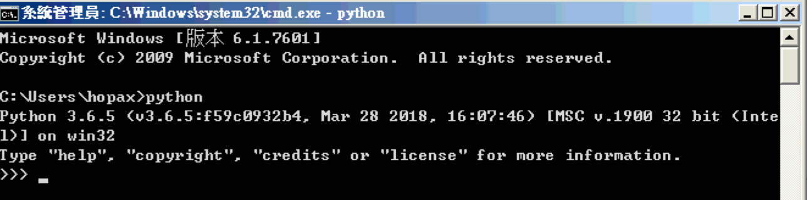

## 環境安裝

使用 Anaconda 安裝 Python - 可以參考[影片](https://goo.gl/68rgcv)進行安裝

+ [Anaconda](https://www.anaconda.com/download/)

或是自行安裝 Python 

+ [Python Download](https://www.python.org/downloads/)

對了，我們**強烈建議安裝 3.7 版本**，但萬一沒有至少要 3.5 以上喔。

如何確認 Python 已經安裝好了呢？

+ Linux or OS X 打開`終端機`鍵入 Python 如果有顯示以下畫面就代表成功:

+ Windows 則打開 `cmd` 鍵入 Python 如果有顯示以下畫面代表成功:

如果一直無法成功，當天你可以選擇提前到教室或是會花半小時請講師或助教協助幫你確認。

## Python 基礎複習

強烈建議如果還不那麼熟悉 Python 語法、資料結構等等可以先回頭複習，這邊準備了一系列基本教學，可以選擇想要的部分做自我練習:

+ [Python 快速簡介](../Python基礎教學/01.Python快速簡介.ipynb)
+ [Python 基本資料型態](../Python基礎教學/02.Python基本資料型態.ipynb)
+ [Python 資料結構](../Python基礎教學/03.Python資料結構.ipynb)
+ [Python 運算符號](../Python基礎教學/04.Python運算符號.ipynb)
+ [Python 條件式](../Python基礎教學/05.Python條件式.ipynb)
+ [Python 迴圈](../Python基礎教學/06.Python迴圈.ipynb)
+ [Python 函式](../Python基礎教學/07.Python函式.ipynb)

或是也可以選擇你喜歡的線上教材做練習，這對課堂上瞭解範例程式碼都會有很大的幫助喔。

## Github 帳號註冊

Github 是目前世界流行的一個開源程式碼控制平台，幾乎所有個開源程式碼(從系統到網頁相關應用)都可以在上面找到，同時你也可以將你的貢獻放在上面提供大家參考(或許也可以把它想像成軟體人的社交平台)。因此我們建議在一切開始前如果沒有 `Github` 帳號，先註冊一個吧。

+ [GitHub](https://github.com/) - 可以[參考](https://progressbar.tw/posts/3)

## 安裝與學會 git 操作指令與使用 Github 平台

Git [下載位置](https://git-scm.com/)，根據作業系統選擇符合的版本。

強烈建議一定要學會 git 基礎指令，我們建議的基礎指令可以參考 Django girl 上這篇[簡短教學](http://djangogirlstaipei.herokuapp.com/tutorials/version-control-with-git/?os=windows)，相關指令節錄如下表格:

|指令語法|說明|
|------|----|
|git init|    在目前目錄建立 Git 檔案庫
|git add <檔案>|    把 <檔案> 加入檔案庫。git add . 可以一次加入全部檔案。
|git commit -m <註記>|  加入一個版本。
|git status|  查看目前的檔案庫狀態。
|git diff|    查看目前檔案庫和上個版本之間的差異。
|git log| 查看版本記錄。

萬一你不知道要怎樣開始練習，推薦 [Git-it](http://jlord.us/git-it/index-zhtw.html) 這個網站學習 Git。

## 選擇熟悉編輯器

適合你的編輯器可以讓開發程式更順暢，以下是我們`建議`的編輯器:

+ [vim](https://www.vim.org/)
+ [Visual Studio Code (Microsoft) ](https://code.visualstudio.com/)
+ [PyCharm (JetBrains)](https://www.jetbrains.com/pycharm/) --> 社群版免費，但進階版付費
+ [Atom (GitHub)](https://atom.io/)
+ [Sublime Text 3](https://www.sublimetext.com/)
+ [Notepad++](http://notepad-plus-plus.org/)
+ [emacs](https://www.gnu.org/software/emacs/)

Sublime 作者較常用的，因為很輕巧也能安裝輔助寫程式的方便套件。至於如何安裝與設定就交給你自己去 Google 囉。